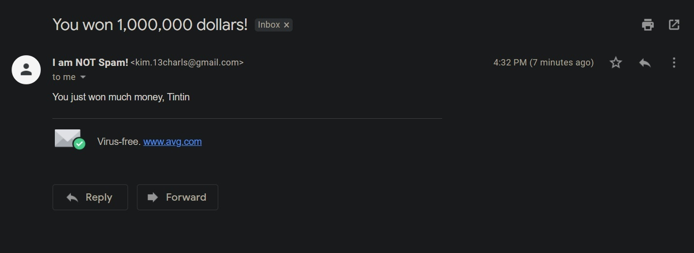

# SPAM-Email-Sender (Python)

This is an automatic email sender system using Python and 
libraries like EmailMessage, SMTPlib, Path and Template libraries.

With this, you can send automatic SPAM emails as much as you like,
or just generate automatic emails in general,

Or, just send as many as Spam emails as you like 😎

